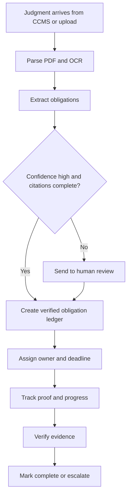
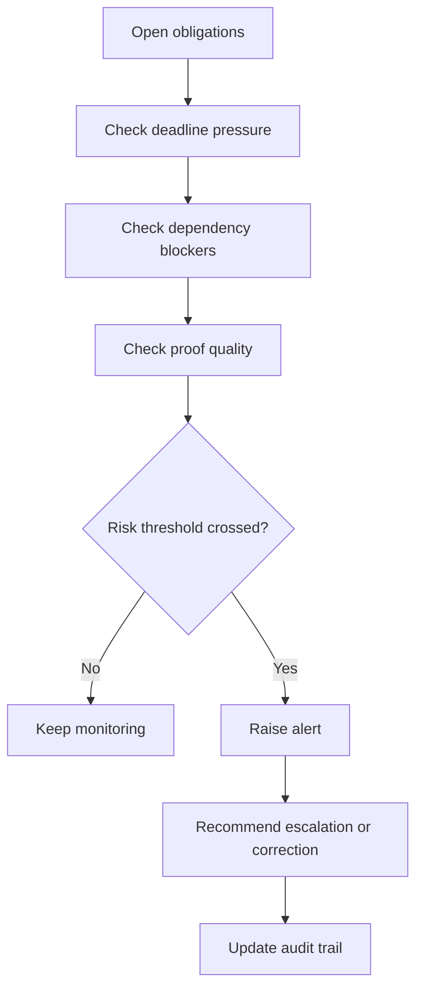

# Theme 11 - OrderFlow

Tagline: Turn court judgments into verified, owner-assigned, deadline-safe actions.

## What OrderFlow Does

Government teams do not fail because judgments are unavailable. They fail because the next step is buried in a PDF, the owner is unclear, the deadline is missed, and no one sees the risk until it is too late.

OrderFlow turns each judgment into a verified obligation ledger. Every directive becomes a trackable task with a source citation, owner, deadline, proof requirement, and escalation path.

## Why OrderFlow Beats the Crowd

Most Theme 11 submissions focus on document extraction, dashboards, or generic compliance summaries. That is useful, but it is not enough.

OrderFlow is built around the threats those ideas leave behind:
- If the AI reads the judgment but misses the legal edge, OrderFlow sends the case into human review instead of guessing.
- If the action is extracted but not owned, OrderFlow assigns the obligation to a real department and a real deadline.
- If the team claims compliance without proof, OrderFlow blocks closure until evidence passes verification.
- If a judgment creates conflicting duties, OrderFlow exposes the conflict and escalates it.

This makes the product feel like a workflow system for government action, not another PDF parser.

## Core Moat

### 1. Verified Obligation Ledger
Convert each judgment directive into a single atomic obligation with owner, due date, dependency, and exact source citation.

### 2. Proof-Gated Completion
Completion only happens when evidence is attached and verified for relevance, date validity, and document match.

### 3. Risk and Escalation Engine
Track deadline pressure, blocked dependencies, and weak evidence so the system can warn before a miss happens.

## Flow 1: Judgment to Verified Action

## Flow 2: Risk and Escalation Loop

## Tech Stack

| Layer | Stack | Purpose |
| --- | --- | --- |
| Frontend | Next.js App Router + TypeScript | Reviewer flow, obligation board, and risk dashboard |
| API | FastAPI + Pydantic v2 | Typed workflow and verification APIs |
| Orchestration | Temporal | Durable task routing and escalation |
| Intelligence | LangGraph | Human-in-the-loop extraction and review control |
| Document parsing | Docling with OCR fallback | Structured parsing for digital and scanned PDFs |
| Storage | PostgreSQL + JSONB + pgvector | Audit-friendly case and evidence storage |
| Queue and cache | Redis | Short-lived workflow state |
| Files | MinIO in dev, S3-compatible storage | Judgment and evidence storage |
| Observability | OpenTelemetry | End-to-end traceability |
| Translation | LibreTranslate | Multi-language judgment support |

## Multi-Language Support

OrderFlow processes court judgments in regional Indian languages (Hindi, Tamil, Telugu, Kannada, Malayalam, Marathi) and English.

**How it works:**
1. **Upload**: Submit a case file in any supported language or English
2. **Auto-Detect**: System automatically detects the document language (with user override option)
3. **Translate**: Case file is translated to English for AI extraction
4. **Extract**: Obligations are extracted from the translated text
5. **Export**: Download the action plan in your original language or English

**Export API:**
- `GET /api/v1/exports/action-plan?document_id=<uuid>&language=<code>&format=markdown|json`
- `language` supports `en`, `hi`, `ta`, `te`, `kn`, `ml`, `mr`

**Supported Languages:**
- English (en)
- हिन्दी (Hindi, hi)
- தமிழ் (Tamil, ta)
- తెలుగు (Telugu, te)
- ಕನ್ನಡ (Kannada, kn)
- മലയാളം (Malayalam, ml)
- मराठी (Marathi, mr)

**Key Benefits:**
- Original court files are preserved for audit trail
- Translation metadata stored for compliance tracking
- Accurate extraction in AI's native language (English)
- User-friendly action plans in their preferred language
- Legal citations and technical terms remain intact for accuracy

For detailed setup and configuration, see [docs/language-support.md](docs/language-support.md).

## What Makes It Strong

- It does not stop at extraction.
- It does not trust the model blindly.
- It does not allow closure without proof.
- It does not hide risk inside a dashboard.

## Demo Storyline

1. Upload a judgment.
2. OrderFlow extracts the key obligations.
3. A reviewer confirms or edits low-confidence items.
4. The system assigns owners, deadlines, and proof requirements.
5. The risk board shows what is blocked, overdue, or likely to slip.
6. Verified evidence closes the loop and moves the case to completion.

## Current Build Status

- Phase A tickets are complete.
- Phase B extraction, citation, review, and risk wiring are already in place.
- Next work focuses on workflow polling, escalation triggers, and reviewer audit trail.

## Where To Continue

- Root development guide: DEVELOPMENT.md
- Service boundaries: app/README.md
